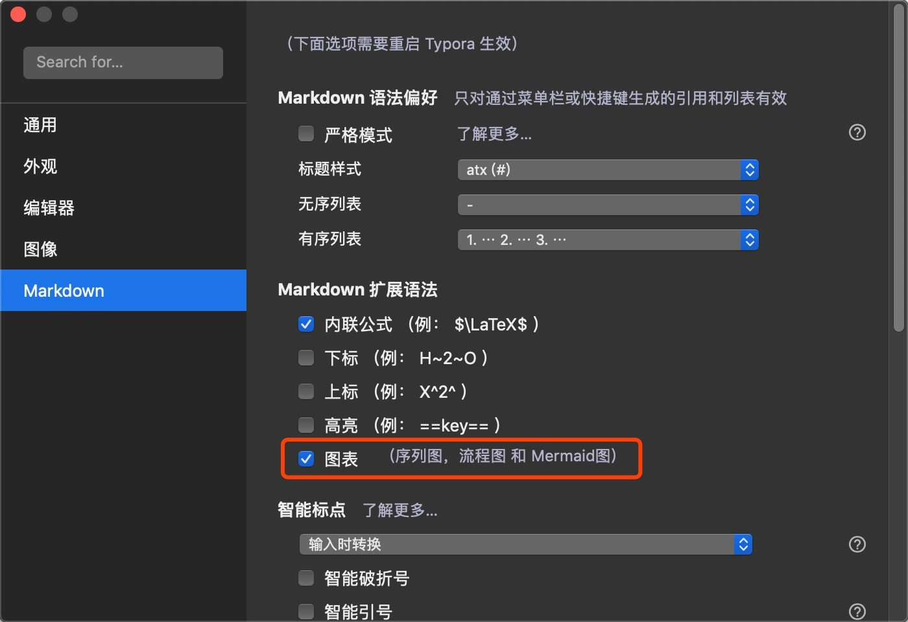

# Markdown 流程图

## 1. 前言

Markdown 的原生语法不支持绘制图形，但通过 Mermaid 扩展，我们可以将一些格式化的文字渲染成我们需要的图形。常用的图形有 “流程图”、“时序图”、“类图”、“状态图”、“甘特图”、"饼图" 等。

[Mermaid](https://mermaid-js.github.io/mermaid/#/) 是一个方便于 Markdown 文档撰写者通过文本方式生成图形的扩展工具。相比 Visio 它要轻很多，几行文字便可生成一幅完整且美观的流程图。

本节将重点介绍如何通过 Mermaid 绘制「流程图」。

流程图（flow chart）是体现封闭系统运动状态的有效展示形式，可以让管理者、实现者清晰的认识系统运转流程，也可以直观的描述工作过程。

**环境说明**：
考虑到 Markdown 工具之间的不兼容，有的内容直接从页面复制粘贴到本地不会正常显示，大家学习时自己动手写是肯定没问题的。本节所有实例代码及演示效果均使用 Typora 工具完成。
Mermaid 为 Markdown 扩展语法，需要在 Typora 设置中开启对图表的语法支持。其方式为：「设置」->「Markdown」->「Markdown 扩展语法」-> 勾选「图表」，如下图：

## 2. 语法详解

### 2.1 基本的流程图

流程图由几何图形节点及连接线组成。几何图形节点是流程图内的各元素的载体，通常用形状来区分其属性，例如圆形代表开始或结束、菱形代表判断等。连接线用于描述几何图形节点之间的联系，可能是有向线段，也可能是无向线段等。

在 Markdown 中添加 Mermaid 图形，需要声明 Mermaid 类型的代码块，代码如下：

~~~markdown
```mermaid
<!-- 此处的内容会被渲染成 mermaid 图形 -->
```
代码块123
~~~

基本的流程图包含：流程图布局方向、几何图形和连接线三个部分组成。

**实例 1**：

基本的竖向流程图。

~~~markdown
```mermaid
graph TD
    开始 --> 结束
```
代码块1234
~~~

此部分代码将会渲染成如下效果：

通过修改图表的声明，可以修改流程图的布局方向。例如将上边的流程图转换为横向流程图。

**实例 2**：

基本的横向流程图。

~~~markdown
```mermaid
graph LR
    开始 --> 结束
```
代码块1234
~~~

渲染后效果如下：

支持的方向有：

| 标志 | 方向                  |
| :--- | :-------------------- |
| TB   | top bottom - 从上到下 |
| BT   | bottom top - 从下到上 |
| RL   | right left - 从右到左 |
| LR   | left right - 从左到右 |
| TD   | 等同于 TB             |

### 2.2 几何图形节点

#### 2.2.1 默认的节点

几何图形节点是流程图中的核心元素，其要素包括形状和内容。

在 Mermaid 语法中，不加任何修饰的文字内容会被渲染成几何图形节点。

**实例 3**：

默认的几何图形。

~~~markdown
```mermaid
graph LR
    几何图形中的文本内容
```
代码块1234
~~~

其渲染结果如下：

#### 2.2.2 分离节点的 ID 与内容

在相对复杂的场景中，同一图形可能被多次引用，如果图形中的文本较长，或者文本内容不足以体现图形的唯一性，可将图形节点的 ID 与其文本内容分开定义，以使结构更加清晰。

**实例 4**：

将节点的 ID 和显示文本区分开。

~~~markdown
```mermaid
graph LR
    一号节点[在此输入希望在一号节点上显示的文字内容]
```
代码块1234
~~~

其渲染结果如下：

#### 2.2.3 节点的形状

形状可用于区分节点的不同属性，有利于丰富流程图的信息量，同时保持其简洁性。

在 Mermaid 中可以使用一些基本符号定义节点的形状，例如：圆角形、跑道形、气缸形、非对称形状、菱形、六角形、平行四边形、梯形。

**实例 5**：

- 圆角形节点的语法。

~~~markdown
```mermaid
graph TD
	节点ID(节点显示文本)
```
代码块1234
~~~

- 圆形节点的语法。

~~~markdown
```mermaid
graph TD
	节点ID((节点显示文本))
```
代码块1234
~~~

- 非对称形节点的语法。

~~~markdown
```mermaid
graph TD
	节点ID>节点显示文本]
```
代码块1234
~~~

- 菱形节点的语法。

~~~markdown
```mermaid
graph TD
	节点ID{节点显示文本}
```
代码块1234
~~~

- 六角形节点的语法。

~~~markdown
```mermaid
graph TD
	节点ID{{节点显示文本}}
```
代码块1234
~~~

- 平行四边形节点的语法。

~~~markdown
```mermaid
graph TD
	右倾平行四边形[/平行四边形--右倾/]
	左倾平行四边形[\平行四边形--左倾\]
```
代码块12345
~~~

- 梯形节点的语法。

~~~markdown
```mermaid
graph TD
  梯形[/梯形--正向\]
	反向梯形[\梯形--反向/]
```
代码块12345
~~~

### 2.3 连接线

#### 2.3.1 基本连接线

在流程图中，不同节点之间需要通过连接线来描述其相关性。

**实例 6**：

基本的连接线语法。

~~~markdown
```mermaid
graph LR
    A-->B
```
代码块1234
~~~

其渲染结果如下：

#### 2.3.2 连接线的种类

不同种类的连接线可以表示不同类型的关系，例如，无方向的连接线可用来表示相关性、有方向的连接线可以表示数据流向或者节点间的依赖关系；用实线表示强关联、用虚线表示弱关联等待。

**实例 7**：

无向线段连接线。

~~~markdown
```mermaid
graph LR
    A --- B -- 带文字连接线 --- C
```
代码块1234
~~~

点状连接线。

~~~markdown
```mermaid
graph LR
    A -.- B -. 带文字连接线 .-> C
```
代码块1234
~~~

粗实连接线。

~~~markdown
```mermaid
graph LR
    A ==> B == 带文字连接线 ==> C
```
代码块1234
~~~

### 2.4 视图分组

对于相对庞大的流程图，可以通过对视图分组，以区分体系内的不同模块，以及不同模块间的关联关系。

**实例 8**：

视图分组。

~~~markdown
```mermaid
graph TB
    c1-->a2
    subgraph 第一组
    a1-->a2
    end
    subgraph 第二组
    b1-->b2
    end
    subgraph 第三组
    c1-->c2
    end
```
代码块12345678910111213
~~~

其渲染结果如下：

## 3. 使用场景及实例

流程图常用于项目的需求分析和设计阶段，也较常出现于程序使用手册中。

**实例 9**：

冒泡排序流程图。

~~~markdown
```mermaid
graph LR
	执行1[i = 1]
  执行2[j = 0]
  执行3[i ++]
  执行4["a = arr[j], b = arr[j + 1]"]
  执行5[交换 a, b]
  执行6[j ++]
	判断1["i < n"]
	判断2["j < n - i"]
  判断3["a > b"]
  开始 --> 执行1
  执行1 --> 判断1
  判断1 --Y--> 执行2
  执行2 --> 判断2
  判断2 --Y--> 执行4
  判断2 --N--> 执行3
  执行3 --> 判断1
  执行4 --> 判断3
  判断3 --N--> 判断2
  判断3 --Y--> 执行5
  执行5 --> 执行6
  执行6 --> 判断2
  判断1 --N--> 结束
```
代码块12345678910111213141516171819202122232425
~~~

渲染效果如下：

## 4. 小结

- Mermaid 为 Markdown 提供了文本转换为图形的扩展功能；
- Mermaid 方式渲染的流程图包含布局方向、图形节点和连接线三个基本要素；
- Mermaid 流程图支持多种节点形状、连接线种类，可以使流程图具有丰富的表现力。